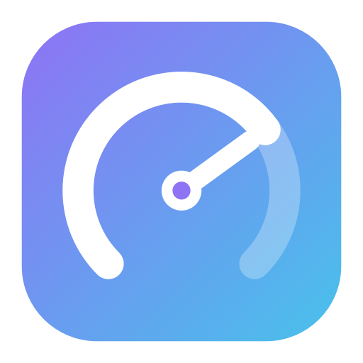

<div align="center">



# AI Usage Bar

<sub>by **Fosivo Labs**</sub>

**Your Claude Code usage limits, live in the macOS menu bar.**

A tiny, private, open-source menu-bar app that shows your rolling **5-hour**
and **weekly** Claude Code limits at a glance — with the current model and a
live reset countdown. Self-hosted: build it yourself, nothing downloaded from
anyone else.

[](LICENSE)


<a href="https://buymeacoffee.com/captainkiez">
  
</a>

</div>

---

## Install

**One line** (downloads the latest release — no Xcode needed):

```sh
curl -fsSL https://raw.githubusercontent.com/captainkie/ai-usage-bar/main/install.sh | bash
```

**Homebrew:**

```sh
brew install captainkie/tap/ai-usage-bar
```

On first launch, approve the Keychain prompt (**Always Allow**), then look for
the `● 5h .. 7d ..` item in your menu bar (and the Touch Bar, if your Mac has
one). Requires macOS 13+ and a signed-in Claude Code.

## What it does

- **`● 5h 12%  7d 45%`** right in your menu bar — updated automatically.
- Click for a panel with progress bars, the model you're on (e.g. *Opus 4.8*),
  and live **"resets in 1h 14m"** countdowns.
- **Touch Bar** — a persistent item in the Control Strip on Macs that have one.
- **Launch at login** toggle.
- **Private by design** — the only network call is to `api.anthropic.com`.
  Your token never leaves your Mac.

## How it works

1. Reads Claude Code's OAuth token from your login **Keychain**
   (`Claude Code-credentials`, read-only).
2. Calls **`GET https://api.anthropic.com/api/oauth/usage`** — the exact
   endpoint Claude Code's `/status` uses.
3. Renders `five_hour` / `seven_day` utilization + reset times.

No analytics, no accounts, no telemetry.

## Platform support

| Platform | Status |
|---|---|
| **macOS 13+** (Ventura and later), Apple Silicon & Intel | ✅ Supported |
| Windows | ❌ Not supported |
| Linux | ❌ Not supported |

The app is built on macOS-only frameworks — the AppKit menu bar
(`NSStatusItem`), the macOS **Keychain**, the **Touch Bar** (`DFRFoundation`),
and `SMAppService`. A Windows or Linux version would not be a port but a
separate build: the **usage-fetch logic** (read the Claude Code token, call
`/api/oauth/usage`) is portable, but the tray UI and credential storage are
platform-specific. On Windows/Linux, Claude Code typically stores its token in
`~/.claude/.credentials.json` (a file) rather than the Keychain, which such a
build would read instead. Contributions welcome.

## Build from source (dev)

Requires macOS 13+, Xcode command-line tools, and a Claude Code login.

```bash
# Quick dev run (menu-bar item appears; no Dock icon)
swift run

# Build a proper .app and install it
./scripts/build-app.sh install
open -a AIUsageBar
```

On first launch macOS asks to allow Keychain access to
`Claude Code-credentials` — click **Always Allow**.

## Security & privacy

Your data stays on your Mac. In short:

- Reads your **existing** Claude Code token from the macOS Keychain —
  **read-only**, and only after you approve the macOS prompt.
- Sends it **only** as a `Bearer` header to **one** endpoint,
  `api.anthropic.com/api/oauth/usage` — the same one `/status` uses.
- **No** other network calls, telemetry, analytics, accounts, or third-party
  SDKs. The token is never written to disk, logged, or sent elsewhere.
- Uses **only your own credentials** to read **your own** usage — it bypasses
  no authentication or access control.

Full details, threat model, and how to verify it yourself:
[SECURITY.md](SECURITY.md) · [PRIVACY.md](PRIVACY.md).

## Roadmap

- [x] Claude Code — 5-hour + weekly limits, model, reset countdowns
- [x] Menu-bar app, `.app` bundle, launch at login
- [x] Touch Bar Control Strip item *(uses private `DFRFoundation` — not App Store safe)*
- [ ] Codex, Gemini, OpenCode providers *(needs those CLIs installed to wire up)*
- [ ] Floating bar view
- [ ] Automatic OAuth token refresh
- [ ] Notarized release download

## Project layout

```
Sources/AIUsageBar/
  main.swift          entry point (+ AIUSAGEBAR_PRINT=1 self-test)
  AppDelegate.swift   NSStatusItem, popover, 60s refresh timer
  PanelView.swift     the SwiftUI panel
  Keychain.swift      reads Claude Code-credentials (read-only)
  UsageService.swift  GET /api/oauth/usage
  UsageModels.swift   response model
  UsageViewModel.swift state + derived values
  LoginItem.swift     launch-at-login (SMAppService)
  TouchBarController.swift  Control Strip item (DFRFoundation bridge)
  Formatting.swift    date parsing, countdowns, severity colors
scripts/build-app.sh  assemble + ad-hoc sign AIUsageBar.app
```

## Support

If this saves you a few `/status` checks, you can
[buy me a coffee ☕](https://buymeacoffee.com/captainkiez) — thank you!

## Legal

**Not affiliated with Anthropic, OpenAI, Google, or Apple.** This tool reads
**your own** local credentials and queries an **undocumented** endpoint to show
**your own** usage; it may break at any time, and you are responsible for
complying with the relevant provider's Terms of Service. Provided **as-is**,
with no warranty. See [DISCLAIMER.md](DISCLAIMER.md) for the full notice,
trademark attributions, and limitation of liability.

## License

[MIT](LICENSE) © 2026 captainkie · Fosivo Labs

> "Claude" and "Anthropic" are trademarks of Anthropic. Other names are
> trademarks of their respective owners; used nominatively.
