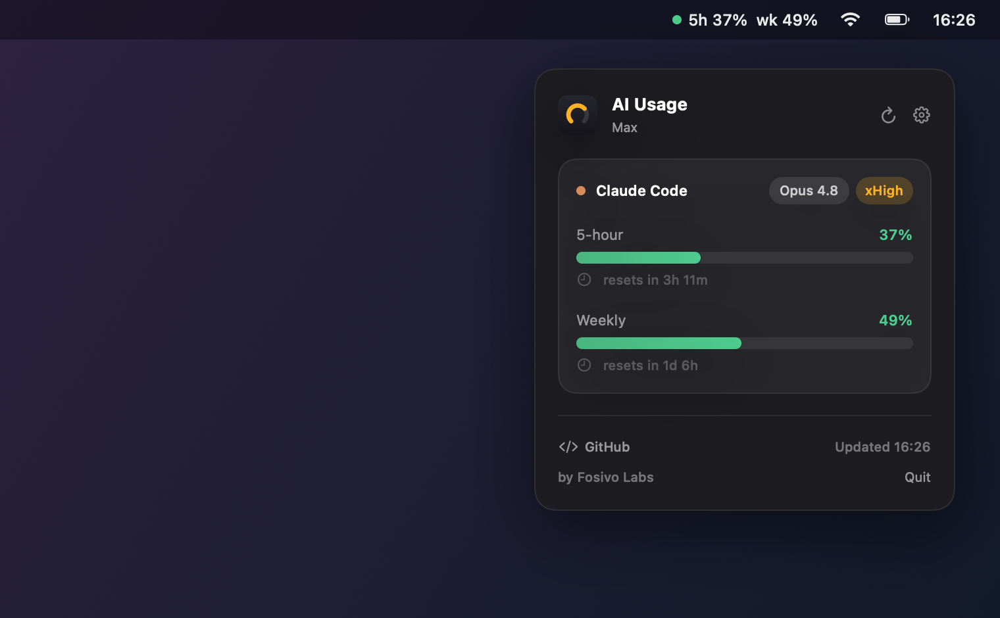
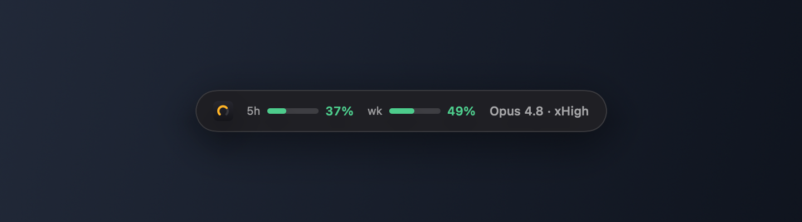

<div align="center">

# AI Usage Bar — Feature Tour

<sub>by **Fosivo Labs**</sub>

Live Claude Code usage limits, always in sight. Here's everything it does.

</div>

---

## 🖥️ The menu-bar panel



At a glance in the menu bar: **`● 5h 37%  wk 49%`**, colour-coded by how close
you are (green → amber → red). Click for the full panel:

- **5-hour** and **weekly** rolling limits with progress bars.
- The **model** you're actually running (e.g. *Opus 4.8*) and your current
  **reasoning effort** (e.g. *xHigh*).
- Live **reset countdowns** — "resets in 3h 11m".
- Your plan (Max / Pro / …) and the last-updated time.

## ⌨️ Touch Bar


On Macs with a Touch Bar, a compact item lives in the **Control Strip** (always
visible, in every app). Tap it to **expand a full-width readout** across the
whole bar. Tap the ✕ to collapse it back.

## 🪟 Floating bar



A draggable pill that floats **above every window** — park it anywhere on
screen. Right-click for *Open panel*, *Settings*, or *Hide*.

---

## ⚙️ Settings & onboarding

- **First-run scan** detects which AI CLIs you're signed in to
  (Claude Code today; Codex / Gemini / OpenCode are scanned and ready).
- Choose **what to show**: 5-hour, weekly, model, reset countdowns.
- Set the **refresh interval** (default 60s, minimum 30s).
- **Launch at login** with one toggle.

## 🔒 Private by design

- Reads your **existing** Claude Code token from the Keychain (**read-only**)
  through Apple's own `security` tool — **no Keychain prompt**.
- The only network call is to `api.anthropic.com` — the same endpoint
  `/status` uses. Your token never leaves your Mac.
- No analytics, no accounts, no telemetry. Fully
  [open source](https://github.com/captainkie/ai-usage-bar) — see
  [SECURITY.md](../SECURITY.md).

---

<div align="center">

## Install

```sh
curl -fsSL https://raw.githubusercontent.com/captainkie/ai-usage-bar/main/install.sh | bash
```

or `brew install captainkie/tap/ai-usage-bar` · macOS 13+

💖 [Sponsor](https://github.com/sponsors/captainkie) · ☕ [Buy me a coffee](https://buymeacoffee.com/captainkiez)

</div>
